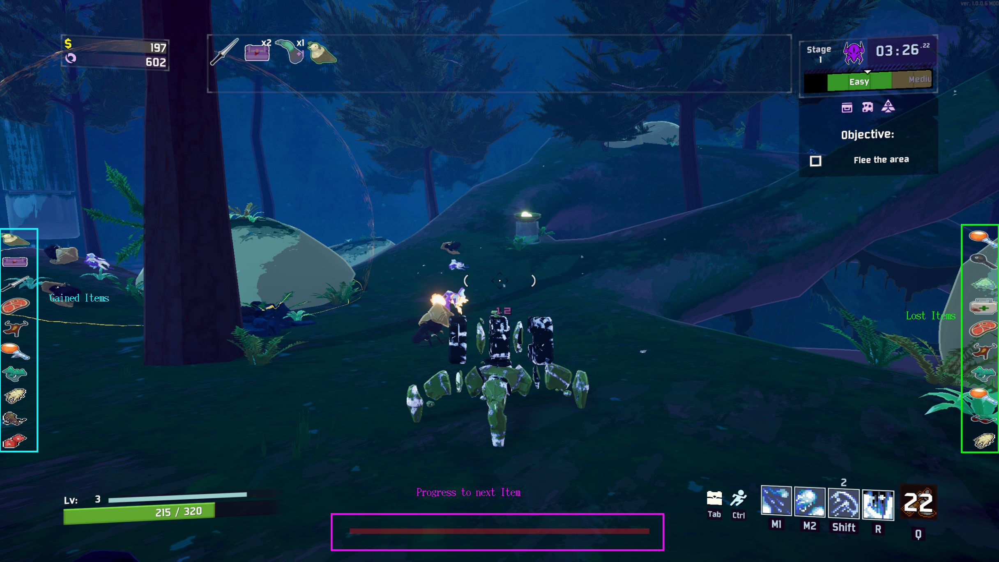

# Artifact of Doom

A mod for Risk of Rain 2.

Adds an artifact to the game which destroys items of your inventory if you take damage but gives you items if you kill enemies.

## Credits
### Design
Special thanks for designing the icons belongs to:
Oroshibu

### Mods used to create this mod
The root projekt was TinkersSatchel:
https://github.com/ThinkInvis/RoR2-TinkersSatchel

For the UI i took parts of Crashaholics UIModifier mod:
https://github.com/Crashaholic/RoR2UIMod

## What does this mod do

With the artifact active, players have a chance to gain items after defeating monsters, but lose items upon taking damage.

There are three new UI-Elements added. There are two sidebars which show the last ten gained/lost items and a progress bar which fills till you get an item.
***In the Sidebars are only the items shown which you obtained/lost by the mod.*** The UI resets every stage.
In the following image you can see these elements:

__If you don't like some or all of the added components you can disable them in the settings. Additionally you can turn on a chat output in exchange.__

## When do i get an item
There are two possible gamemodes. 
### Default mode
It is specified when to get an item by the following formula:
(0.5+0.5*arctan(0.4*totalItems-ArtifactOfDoomConfig.averageItemsPerStage*(1+currentStage)/2)/2)*40-3)

The curve is the following:


by setting the value for averageItemsPerStage in the settings you can specify how many kills you need for one item.


Everytime you get hit you'll lose an item. The only exception is if you've less items then the configured minItemsPerStage.
If that is the case you have a chance that you will not use an item.  
The calculation for this is:
```squareroot(totalItems/(minItemsPerStage*CurrentStage));```
minItemsPerStage can be configured in the setting. For example you've 6 items and are on stage 5. The configured minItemsPerStage are 2 (default).
So you've the calculation:
(6/(2*5))^0.5=0,77 that means you've a change of 77% to not lose an item.

On the other hand the possibility increases if you've more items than you should have to lose more than one item. The formular to calculate that is:
```(totalItems) / (maxItemsPerStage * currentStage)^exponentailFactorToCalculateSumOfLostItems```
maxItemsPerStage and exponentailFactorToCalculateSumOfLostItems are configurable and have a default value of 7 and 1.5.
For example you've 50 items, are on stage 5 and have the default values so you calculate:
(50 / (7 * 5))^1.5=1.7
So you'll have a 100% chance to lose one item and 70% chance to lose another.

### Sacrifice like mode
The Sacrifice like mode can be enabled in the settings. If it's enabled you've a chance to get an item with every enemy. The base chance for getting an item is 10%. 

## Other mechanics

After you lost an item you'll get a short buff that prevents you from loosing another one. The length of that buff depends on the difficulty and can also be configured with the config entitys "timeAfterHitToNotlose".
The default settings are 0,8 second protection on Drizzly, 0,2 on Rainstorm and 0.05 seconds on Monsoon

## Character specific settings
In the settings you can specify for each character how many items he'll get if he kills enough enemys and if he has an additional multiplier to the buff after loosing an item. The default settings are that every meele char has a 4 times longer buff and Artificer get double as many items if he kills enough enemies.

## Custom Characters
Custom character don't have character specific settings by default. But you can add them in the config file. To do so edit ```CustomCharacters``` and set the  values in json format.
e.g.:
[{"Name": "AATROX_NAME", "MultiplierForTimedBuff": 2.0, "BonusItems": 1.0},{"Name": "MINER_NAME", "MultiplierForTimedBuff": 2.0, "BonusItems": 2.0}]
The name of the character is written in the console after killing an enemy or loseing an item. You can add as many characters as you need. Just add them seperated by ",".
You don't have to escape the " by doing \" but the default setting is escaped. 

## I've an issue:
Please add an issue to my github repository:
https://github.com/SirHamburger/ArtifactOfDoom
You can also reach me in Discord (sirhamburger)
