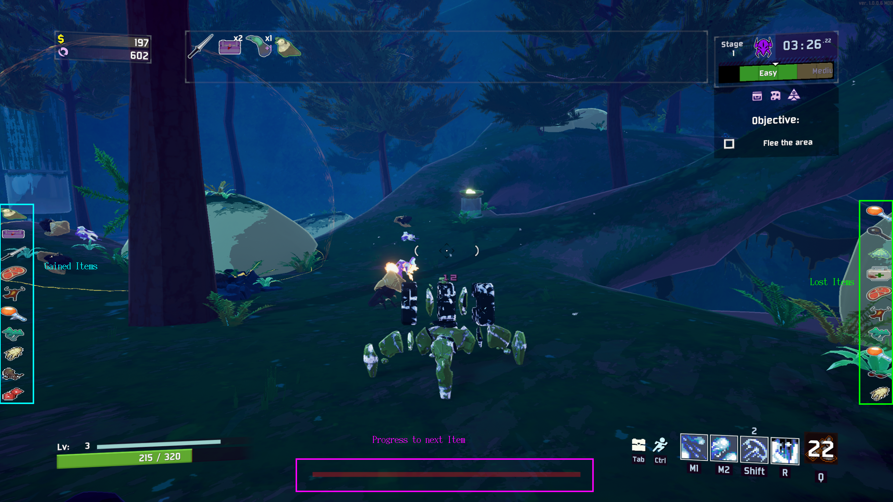

# Artifact of Doom

A mod for Risk of Rain 2.

Adds an artifact to the game which destroys items of your inventory if you take damage but gives you items if you kill enemies.

##Credits
### Design
Special thanks for designing the icons belongs to:
Oroshibu

### Mods used to create this mod
The root projekt is TinkersSatchel:
https://github.com/ThinkInvis/RoR2-TinkersSatchel

For the UI i took parts of Crashaholics UIModifier mod:
https://github.com/Crashaholic/RoR2UIMod

And the Multiplayer UI support is based on the Example of MiniRPC:
https://github.com/wildbook/R2Mods/tree/develop/MiniRpcLib

## What does this mod do

With the artifact active, players have a chance to gain items after defeating monsters, but lose items upon taking damage.

There are three new UI-Elements added. There are two sidebars which show the last ten gained/lost items and a progress bar which fills till you get an item.
***In the Sidebars are only the items shown which you obtained/lost by the mod.*** The UI resets every stage.
In the following image you can see these elements:

__If you don't like some or all of the added components you can disable them in the settings. Additionally you can turn on a chat output in exchange.__

## When do i get an item
There are two possible gamemodes. 
### Default mode
The calculation for the required kills is:
```(totalItems - currentStage * averageItemsPerStage) ^ exponentTriggerItems```
`totalItems` is the current item count of each character. `CurrentStage` is the number of stages completed and `exponentTriggerItems` and `averageItemsPerStage` can be changed in the config file.
For example you've 20 items and are on stage 5. The configured averageItems are 3 (default). That means you've to kill (20-5*3)^2=25 enemies to get one item.

Everytime you get hit you'll lose an item. The only exception is if you've less items then the configured minItemsPerStage.
If that is the case you have a chance that you will not use an item.  
The calculation for this is:
```squareroot(totalItems/(minItemsPerStage*CurrentStage));```
minItemsPerStage can be configured in the setting. For example you've 6 items and are on stage 5. The configured minItemsPerStage are 2 (default).
So you've the calculation:
(6/(2*5))^0.5=0,77 that means you've a change of 77% to not lose an item.

On the other hand the possibility increases if you've more items than you should have to lose more than one item. The formular to calculate that is:
```(totalItems) / (maxItemsPerStage * currentStage)^exponentailFactorToCalculateSumOfLostItems```
maxItemsPerStage and exponentailFactorToCalculateSumOfLostItems are configurable and have a default value of 7 and 1.5.
For example you've 50 items, are on stage 5 and have the default values so you calculate:
(50 / (7 * 5))^1.5=1.7
So you'll have a 100% chance to lose one item and 70% chance to lose another.

### Sacrifice like mode
The Sacrifice like mode can be enabled in the settings. If it's enabled you've a chance to get an item with every enemy. The base chance for getting an item is 10%. 

## Other mechanics

After you lost an item you'll get a short buff that prevents you from loosing another one. The length of that buff depends on the difficulty and can also be configured with the config entitys "timeAfterHitToNotlose".
The default settings are 0,8 second protection on Drizzly, 0,2 on Rainstorm and 0.05 seconds on Monsoon

## Character specific settings
In the settings you can specify for each character how many items he'll get if he kills enough enemys and if he has an additional multiplier to the buff after loosing an item. The default settings are that every meele char has a 4 times longer buff and Artificer get double as many items if he kills enough enemies.

## Custom Characters
Custom character don't have character specific settings by default. But you can add them in the config file. To do so edit ```CustomCharacters``` and set the  values in json format.
e.g.:
[{"Name": "AATROX_NAME", "MultiplierForTimedBuff": 2.0, "BonusItems": 1.0},{"Name": "MINER_NAME", "MultiplierForTimedBuff": 2.0, "BonusItems": 2.0}]
The name of the character is written in the console after killing an enemy or loseing an item. You can add as many characters as you need. Just add them seperated by ",".
You don't have to escape the " by doing \" but the default setting is escaped. 

## I've an issue:
Please add an issue to my github repository:
https://github.com/SirHamburger/ArtifactOfDoom
You can also reach me in Discord (Sir Hamburger#8447)

## Patchnotes
### Version 1.2.0
* Language independency
* Support for custom characters
* Fix for bad scaled sidebars
It can be that the scaling of the sidebars is too huge since the scaling settings didn't reset. In that case set ```sizeOfSideBars``` to 0.02


### Version 1.1.1
Fix for Progressbar after taking an item

### Version 1.1.0
* Added support for not 16/9 Resolution
* Added new UI-Settings
* Changed Artifact logo
* Changed Thunderstore logo
* Changed Settings into groups (it can be that you've to update your own settings.)
### Version 1.0.1
* Added progress bar
* Added Artifact of Sacrifice like item gain
* Added formular for gaining items if under average items
* Added nerf for ArtifactOfSwarm

### Version 0.9.4
Tougher Times now working (hopefully).

### Version 0.9.3
Added own icon as fix for compability with TinkersSatchel
It looks bad (very bad) but at least it works

### Version 0.9.2
Temporary fix for compability with TinkersSatchel

### Version 0.9.1
* Fixed bug in multiplayer when one ally dies you don't see your gain/lost items
* Added exponential function to items gained
* Added root function to items lost
* Fixed calculation bugs for loosing items (so you will lose less items if your below the minItemCount)

### Version 0.9.0
Added Character specific settings and a timed buff which prevents you from loosing items

### Version 0.8.1 
Updated dependency in manifest.json (inserted Tiler2)

### Version 0.8.0
Initial upload